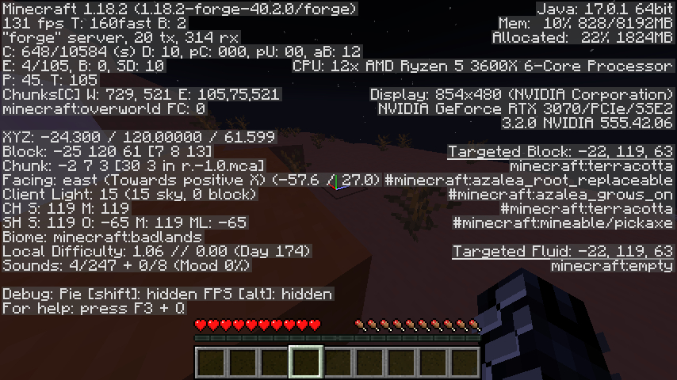
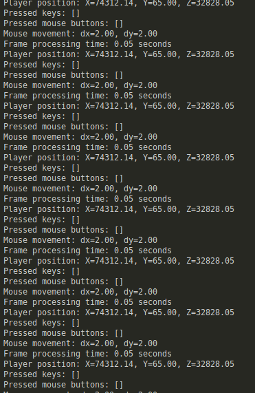

# MC-Labeller




> Note: This project was developed and tested on Ubuntu 22.04 Linux and macOS. The process may differ on Windows.

## Why I Built This

I created MC-Labeller as an alternative to projects like Malmo and MineRL, which are Minecraft environments for reinforcement learning agents. After experiencing difficulties with these existing solutions on various operating systems, I decided to build my own version. This allows me to:

- Create data when I'm away from home (possibly during university lectures)
- Control which Minecraft version to use
- Customize internal commands that provide utility to Python
- Access my home Linux server from anywhere using Tailscale
- Offload intensive computations to my home server, even when I'm elsewhere
- Have fun while learning!

I plan to follow up by using the collected tree mining data to train a Minecraft agent (a deep neural network allowed to interact with the game) to generalize over and mimic human behavior.

## Setup Instructions
> minecraft version 1.20.1; fabric loader version 0.16.9
### Pre-setup (linux)

```bash
sudo apt update && sudo apt upgrade -y && sudo apt autoremove
sudo apt install openjdk-17-jre-headless -y
mkdir server
mkdir -p ~/.minecraft/mods
```

### Pre-setup (macOS)
```bash
brew install openjdk@17

sudo ln -sfn $(brew --prefix)/opt/openjdk@17/libexec/openjdk.jdk /Library/Java/JavaVirtualMachines/openjdk-17.jdk
# may need to set environment variables...
# install fabric and download the fabric api
wget https://maven.fabricmc.net/net/fabricmc/fabric-installer/1.0.1/fabric-installer-1.0.1.jar
java -jar fabric-installer-1.0.1.jar
# download: https://www.curseforge.com/minecraft/mc-mods/fabric-api/files/5383715
cp fabric-api-0.92.2+1.20.1.jar ~/Library/Application Support/minecraft/mods
```

## Build the mod
```bash
# in java-to-python (action recorder), run
./gradlew genSources
./gradlew build

# then copy the mods from build/libs to your mods folder (.minecraft on linux, ~/Library/Application Support/minecraft/mods on macOS)

```

## How to Play
- J to start recording, K to stop recording
- soon... L to teleport to a random location in the world (new data sample)


## Neural Nets
- in `neural-nets`, v1 is for printing out the image shapes you'd ideally feed into the neural net (batchloader). v2 is the training and dataloader template code. we would sub in the training logic, optimizers, seperate NN classes, hyperparams, loss funcs

